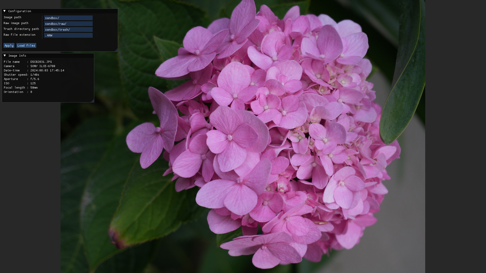

# photoViewer
A photo viewer application written in C++ using [raylib](https://www.raylib.com/) and [ImGui](https://github.com/ocornut/imgui). This application will also delete raw image files (if found). For now, the deleted images will be moved to a trash directory which can be specified. See [Usage](#Usage) section for more information on using the application.


## Prerequisites
* [CMake](https://cmake.org/download/)


## Build and Run
### For linux
- Debug mode
```
source ./buildandrundbg.sh
```
- Release mode
```
source ./buildandrun.sh
```

### Alternatively
- Debug mode
```
cmake -B build/ -S . -DCMAKE_BUILD_TYPE=Debug
cmake --build build/
./build/src/photoViewer
```
- Release mode
```
cmake -B build/ -S . -DCMAKE_BUILD_TYPE=Release
cmake --build build/
./build/src/photoViewer
```


## Usage
- As of now the application will only display png/jpeg images. You can darg-and-drop the files or use command-line args. To get the list of all args:
```
./build/src/photoViewer --help
```

### Controls:
NOTE: most of these controls will be blocked if a window (UI) is in focus or an input text field is in focus.

- `CTRL+Q` - Quit
- `F` - Toggle fullscreen
- `Esc` - Unfocus all windows (ui)
- `H` - Show/hide UI
- `I` - Show/hide image info window
- `P` - Show/hide config window (configure paths for image, raw image and trash directory)
- `'Scroll up' or '=' or 'W'` - Zoom in
- `'Scroll down' or '-' or 'S'` - Zoom out
- `Left click and drag` - move the image
- `'0' or 'Z'` - Reset zoom
- `']' or 'E'` - Rotate clockwise
- `'[' or 'Q'` - Rotate counter clockwise
- `R` - Reset image (resets zoom, rotation and position)
- `'D' or 'Right arrow'` - Next image
- `'A' or 'Left arrow'` - Previous image
- `Home` - Go to first image
- `End` - Go to last image
- `'X' or 'Delete'` - Delete image (for now the deleted images get moved to `trash` directory, which can be specified)


## Screenshots

